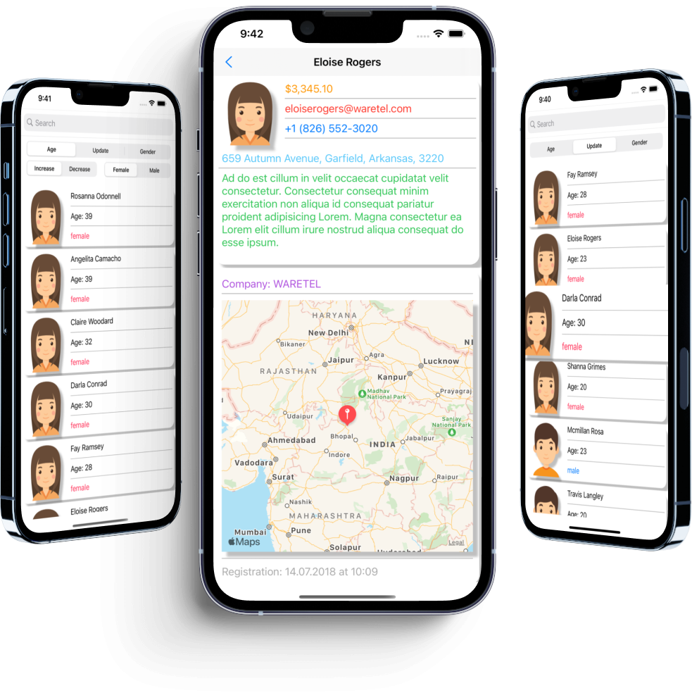

# Friends

## Introduction

Hi, my name is Aleksandr. I'm glad to see you on my [GitHub](https://github.com/AleksandrBasov?tab=repositories).

## Features

The application is developed in Swift language. I used MVVM architecture in my project.

<h1 align="center">

</h1>

In this application, you can filter by gender and age, search by name, and also shows the coordinates of the place on the MapView. By pressing on CollectionViewCell, the cell is increase. 
